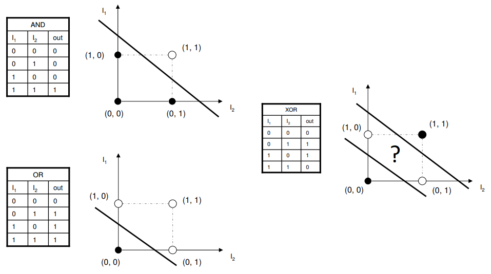

# Chapter02: Perceptron
> ~~

## What is perceptron?
A perceptron is a basic unit of a neural network. It has two factors `w`(weight) and `b`(bias).

- `weight`  : How much the input affect the output
- `bias`    : What the perceptron will output without input.

## Why does perceptron matter?
For example, there are simple perceptrons, AND, NAND, OR gates. When there are two inputs(`x1`, `x2`), the gates can be expressed like below.
```python
def GATE(x1, x2):
    X = np.array([x1, x2])
    W = np.array([weight1, weight2])
    b = bias
    
    tmp = np.sum(X * W) + b

    if tmp <= 0:
        return 0
    elif tmp > 0:
        return 1 
```

|gate  |`w1`  |`w2`  |`b`   |
|------|------|------|------|
|AND   |0.5   |0.5   |-0.7  |
|NAND  |-0.5  |-0.5  |0.7   |
|OR    |0.5   |0.5   |-0.1  |
|XOR   |?     |?     |?     |

These are some of the possible combinations. Try to think about the XOR gate (which is true when x1 and x2 are different). It is not possible with a single perceptron because perceptron can be expressed as
$$
f(x)=
\begin{cases}
0 & \text{(} w_1x_1 + w_2x_2 + b \leq 0 \text{)}\\
1 & \text{(} w_1x_1 + w_2x_2 + b > 0 \text{)}
\end{cases}
$$

As you can see, perceptron is a linear function of x1 and x2. So we need to use multiple perceptrons. We can make XOR gate with AND, NAND, OR gates. 
$$
XOR(x_1, x_2) = AND(NAND(x_1, x_2), OR(x_1, x_2))
$$
Now we solved a nonlinear problem with linear functions. We can adapt this to many situations

## It's possible to make computer with NAND gate
With basic gates(AND, OR, NOT), every computers can be made. And, NAND can make AND and OR gates
$$
\begin{aligned}
NOT(x)          &= NAND(x, x)& \\
AND(x_1, x_2)   &= NAND(NAND(x_1, x_2), NAND(x_1, x_2)) \\
OR(x_1, x_2)    &= NAND(NAND(x_1, x_1), NAND(x_2, x_2))
\end{aligned}
$$
Theoretically, It's possible to make any computer only with NAND.